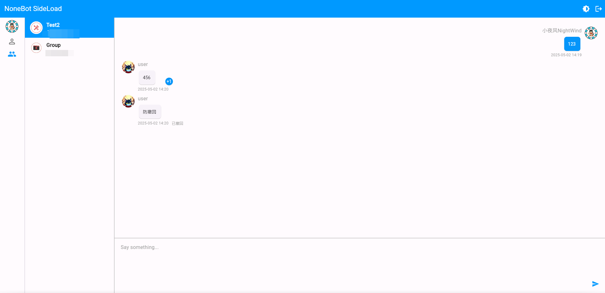
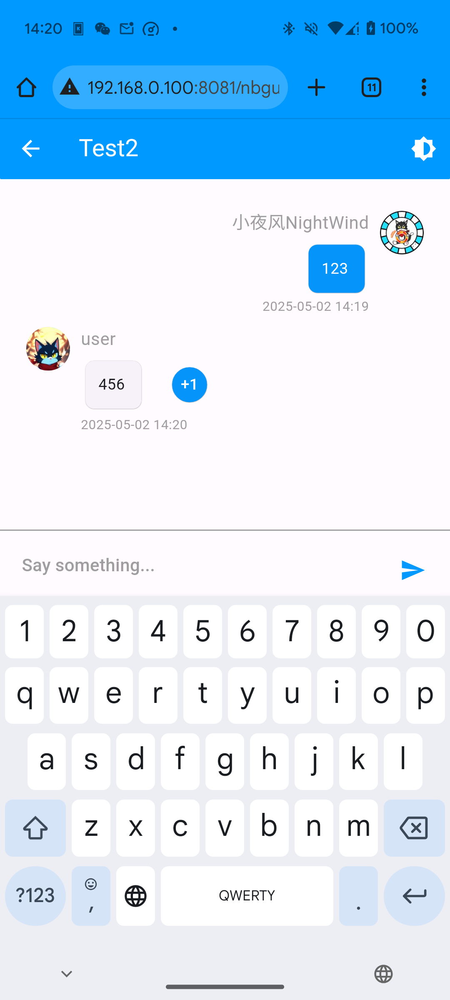
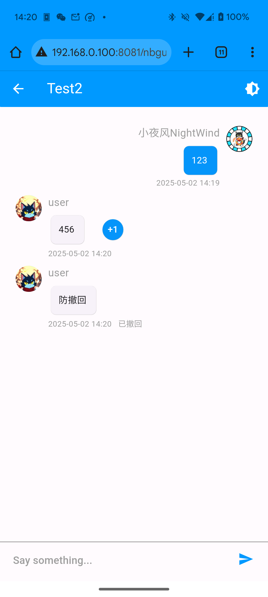

<div align="center">
  <a href="https://webui.nbgui.top"></a>
  <br>
  <p></p>
</div>

<div align="center">

# nonebot-plugin-sideload

_✨ 为你的NoneBot侧载一个OneBot V11 Web聊天面板 ✨_


<a href="./LICENSE">
    
</a>
<a href="https://pypi.python.org/pypi/nonebot-plugin-sideload.svg">
    
</a>


</a>
</div>


> [!warning] 
> 当前版本由于频繁使用 `call_api` ，容易造成风控，请谨慎思考后再安装！！！

## 📖 介绍

为你的NoneBot侧载一个OneBot V11 Web聊天面板，连接到Bot即可使用

## 💿 安装

<details open>
<summary>使用 nb-cli 安装</summary>
在 nonebot2 项目的根目录下打开命令行, 输入以下指令即可安装

    nb plugin install nonebot-plugin-sideload

</details>

<details>
<summary>使用包管理器安装</summary>
在 nonebot2 项目的插件目录下, 打开命令行, 根据你使用的包管理器, 输入相应的安装命令

<details>
<summary>pip</summary>

    pip install nonebot-plugin-sideload
</details>
<details>
<summary>pdm</summary>

    pdm add nonebot-plugin-sideload
</details>
<details>
<summary>poetry</summary>

    poetry add nonebot-plugin-sideload
</details>
<details>
<summary>conda</summary>

    conda install nonebot-plugin-sideload
</details>

打开 nonebot2 项目根目录下的 `pyproject.toml` 文件, 在 `[tool.nonebot]` 部分追加写入

    plugins = ["nonebot_plugin_sideload"]

</details>

## ⚙️ 配置

| 配置项 | 必填 | 默认值 | 说明 |
|:-----:|:----:|:----:|:----:|
| sideload_password | 是 | abc123456 | 面板的访问密码 |


## 🎉 使用

Bot连接后，控制台会输出面板的地址，在浏览器中打开即可访问，一般来说，它是长这样子的：

```
http://ip:port/nbgui/v1/sideload
```


## 📑 支持的功能

- [x] 图片显示
- [x] +1按钮
- [x] 消息时间显示
- [ ] 持久化登录
- [ ] 用户自定义设置
- [ ] 好友/加群申请
- [ ] 群成员管理
- [ ] 消息右键菜单
- [ ] 用户信息
- [ ] 群信息
- [ ] 发送图片
- [ ] 消息撤回
- [X] 暂时想不到了qwp


## 🖼️ 效果图






